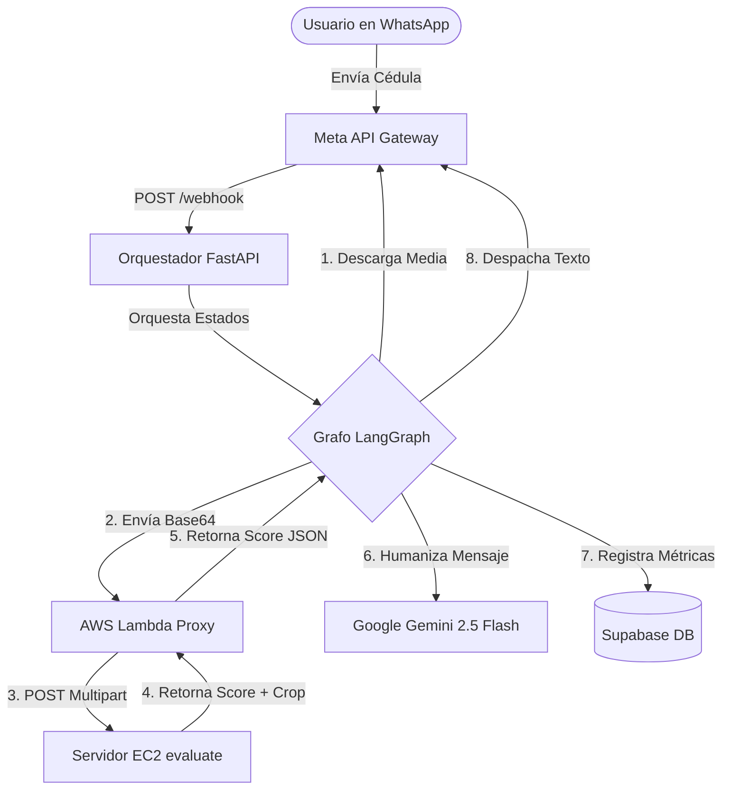

# Guía de Arquitectura y Reglas para Agentes de Código — Backend (detection_attacks)

Bienvenido. Este repositorio contiene el backend del proyecto **Detection Attacks**, un orquestador conversacional que realiza validación de identidad y detección de fraude en cédulas colombianas a través de WhatsApp.

Este documento detalla el diseño técnico del sistema para que cualquier agente de IA pueda entender el codebase rápidamente.

---

## 1. Arquitectura General y Flujo de Datos

El backend está desarrollado en **FastAPI** y sigue el siguiente flujo de procesamiento de punta a punta:

### Detalle de Capas
1. **Orquestador (FastAPI):** Expone el webhook de Meta (`POST /webhook`) con firmas de seguridad HMAC-SHA256, deduplicación en memoria de peticiones duplicadas de Meta, y endpoints de métricas (`GET /api/metrics`) para alimentar el dashboard frontend.
2. **Máquina de Estados (LangGraph):** Define los flujos conversacionales mediante nodos de procesamiento secuencial.
3. **AWS Lambda Proxy (`receiveCodedImage`):** Una función Serverless que recibe la imagen codificada, la transforma a buffer binario y la envía en un formato multipart/form-data al servidor EC2.
4. **Clasificador (AWS EC2):** Servidor dedicado que expone un endpoint (`:8001/evaluate/`) que analiza el documento y retorna un `score` continuo de 0 a 1 (`0 = Real`, `1 = Fraude/Copia`) y un objeto `detection` con metadatos espaciales.
5. **Humanizador (Google Gemini 2.5 Flash):** Recibe el análisis técnico de AWS/EC2 y redacta una respuesta conversacional amigable para WhatsApp en español.

---

## 2. Reglas del Grafo conversacional (LangGraph)

El estado se maneja en el objeto `AgentState` que contiene variables conversacionales y métricas:

### Estados y Transiciones:
- **`GREETING`:** Entrada inicial. Se saluda al usuario y se solicita la cara frontal. Transiciona a `AWAITING_FRONT`.
- **`AWAITING_FRONT`:** Espera el envío de la foto frontal. Al recibirla, se invoca `process_front_node` y, de ser válida, el estado cambia a `AWAITING_BACK`.
- **`AWAITING_BACK`:** Espera la foto trasera. Al recibirla, se invoca `process_back_node` y se consolida el veredicto final. El estado cambia a `DONE`.
- **`DONE`:** Proceso de validación finalizado. Invita a escribir `reiniciar` para procesar otro documento.

### Comando Especial:
Cualquier mensaje textual del usuario que equivalga a **`reiniciar`** (independiente de mayúsculas) interrumpe inmediatamente el flujo, ejecuta `reset_flow` para vaciar las variables de sesión en Supabase y redirige al usuario a `GREETING`.

---

## 3. Modelo de Persistencia (Supabase)

- **`whatsapp_sessions`:** Guarda el estado conversacional del usuario (`phone` es la llave primaria, `state`, `front_result` y `back_result`).
- **`validation_logs`:** Bitácora transaccional e histórica que captura el número de teléfono, timestamp, nodo ejecutado, latencia de AWS en ms, latencia de Gemini en ms, veredicto (`is_photocopy`) y el ID del mensaje enviado (`whatsapp_message_id`).
- **Importante:** La base de datos utiliza un pooler transaccional en el puerto `6543`. Es obligatorio configurar `statement_cache_size=0` en las conexiones de `asyncpg` para prevenir prepared statement crashes.

---

## 4. Reglas Críticas para Modificaciones

1. **Evitar Respuestas Truncadas de Gemini:** Al usar Gemini 2.5 Flash con el SDK `google-genai`, el modelo consume tokens en su proceso de pensamiento interno. El parámetro `max_output_tokens` debe estar establecido en al menos **`1000`** tokens para evitar que las oraciones se corten con el estado `FinishReason.MAX_TOKENS`.
2. **Umbral de Decisión de Fraude:** El score retornado por el modelo en EC2 es evaluado con el umbral $\tau = 0.5$. Puntuaciones superiores o iguales a `0.5` se catalogan como fraude (`is_photocopy = True`).
3. **Evitar Saludos Repetitivos:** Gemini no debe saludar (por ejemplo, omitir "Hola") en los estados intermedios del flujo conversacional una vez iniciado el proceso.
